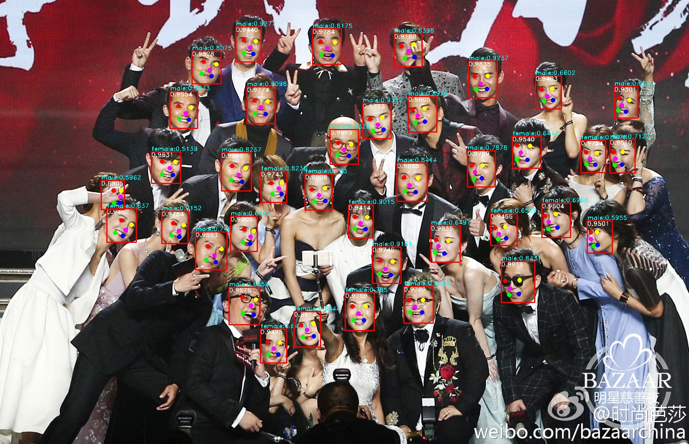
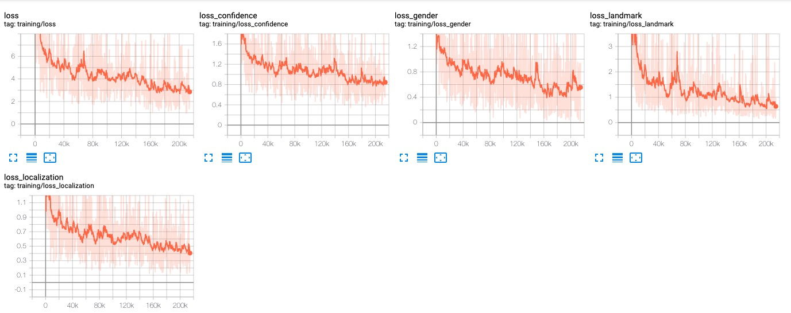
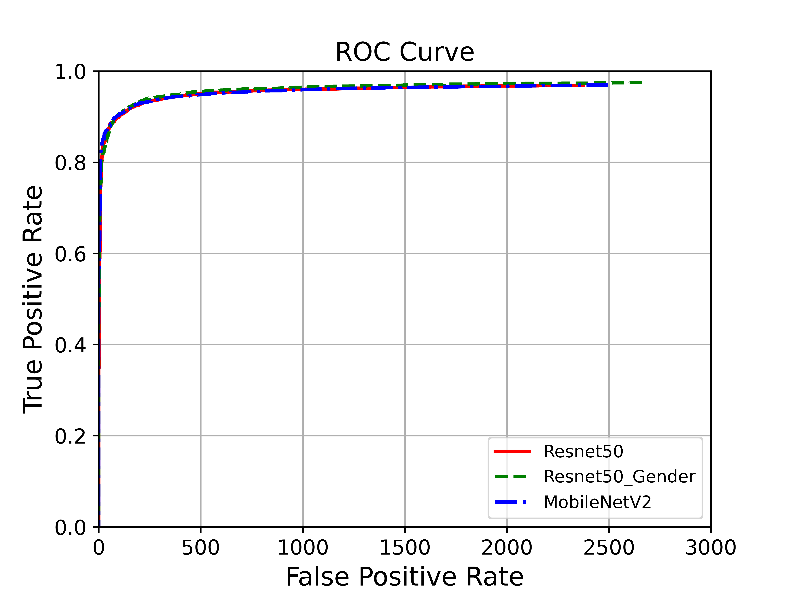
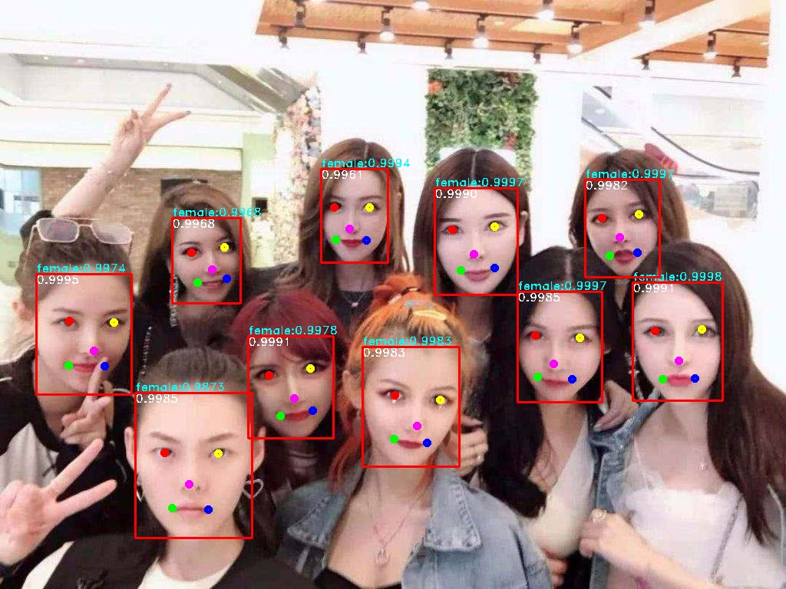
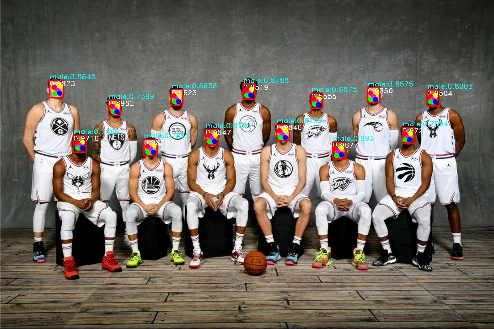

# RetinaFace with Gender
  </a>
  </a>
  </a>
  </a>
  </a>
  <a href="https://opensource.org/licenses/MIT"></a>


<p align="center">

<br>
The demo of retinaface with gender.</p>

## Description  

 - **backbone**: *mobilenet-v2 ｜ resnet50*
 - **datasets**: *widerface*
 - **addition**: *在原始网络中加入性别判断，目前仅在resnet50中支持，*[cfg_re50.gender=True](./data/config.py)
 - **tensorboard**: 
 
  

- **FDDB ROC**:
 
  

- **demo**:
 
  
  
  
  
  


## Pretrained Models

I provide all of the model to test.
链接: https://pan.baidu.com/s/1MYylkAeOW-5Uk3LnwdfgwA  密码: w8uw

| Path | Description
| :--- | :----------
|[torch](https://pan.baidu.com/s/1MYylkAeOW-5Uk3LnwdfgwA) | weight of pytorch
|[onnx](https://pan.baidu.com/s/1MYylkAeOW-5Uk3LnwdfgwA) | weight of onnx
|[openvino](https://pan.baidu.com/s/1MYylkAeOW-5Uk3LnwdfgwA) | weight of openvino
|[tensorrt](https://pan.baidu.com/s/1MYylkAeOW-5Uk3LnwdfgwA) | weight of tensorrt

## Comparison
*All test on ubuntu 18.04 | 8  Intel(R) Core(TM) i5-8300H CPU @ 2.30GHz |  GeForce GTX 1060 6G*

**Resnet50 with Gender**
|Name|Time(s)|
|:---|:--|
|torch gpu|0.0159|
|torch cpu|0.1233|
|onnx|0.0661|
|openvino|0.0595|
|tensorrt|0.0084|


## Test
### torch
```
python scripts/test_images.py \
--ckpt ./ckpt/torch/Resnet50_Gender_Final.pth \
--cfg config/res50_gender.yaml \
--device cpu \
--images_path test_images \
--save results
```

### onnx
```
python scripts/test_onnx.py \
--ckpt ./ckpt/onnx/retinaface-res50-gender-320.onnx \
--cfg config/res50_gender.yaml \
--images_path test_images \
--save results
```

### openvino
``` 
python scripts/test_openvino.py \
--xml ./ckpt/openvino/res50/retinaface-res50-gender-320.xml \
--bin ./ckpt/openvino/res50/retinaface-res50-gender-320.bin \
--cfg config/res50_gender.yaml \
--images_path test_images \
--save results
```

### tensorrt
recommend use docker: 
```
docker pull nvcr.io/nvidia/pytorch:20.09-py3
```
then:
```
docker run -it --rm --runtime nvidia  --network host -v $PWD:/home  --name tensorrt nvcr.io/nvidia/pytorch:20.09-py3
```
run:
```
python scripts/test_tensorrt.py \
--ckpt ./ckpt/tensorrt/Resnet50_Gender_Final_Trt.pth \
--cfg config/res50_gender.yaml \
--images_path test_images \
--save results
```

## Citation

This code is heavily based on [Pytorch_Retinaface](https://github.com/biubug6/Pytorch_Retinaface)  🙏🙏🙏 


